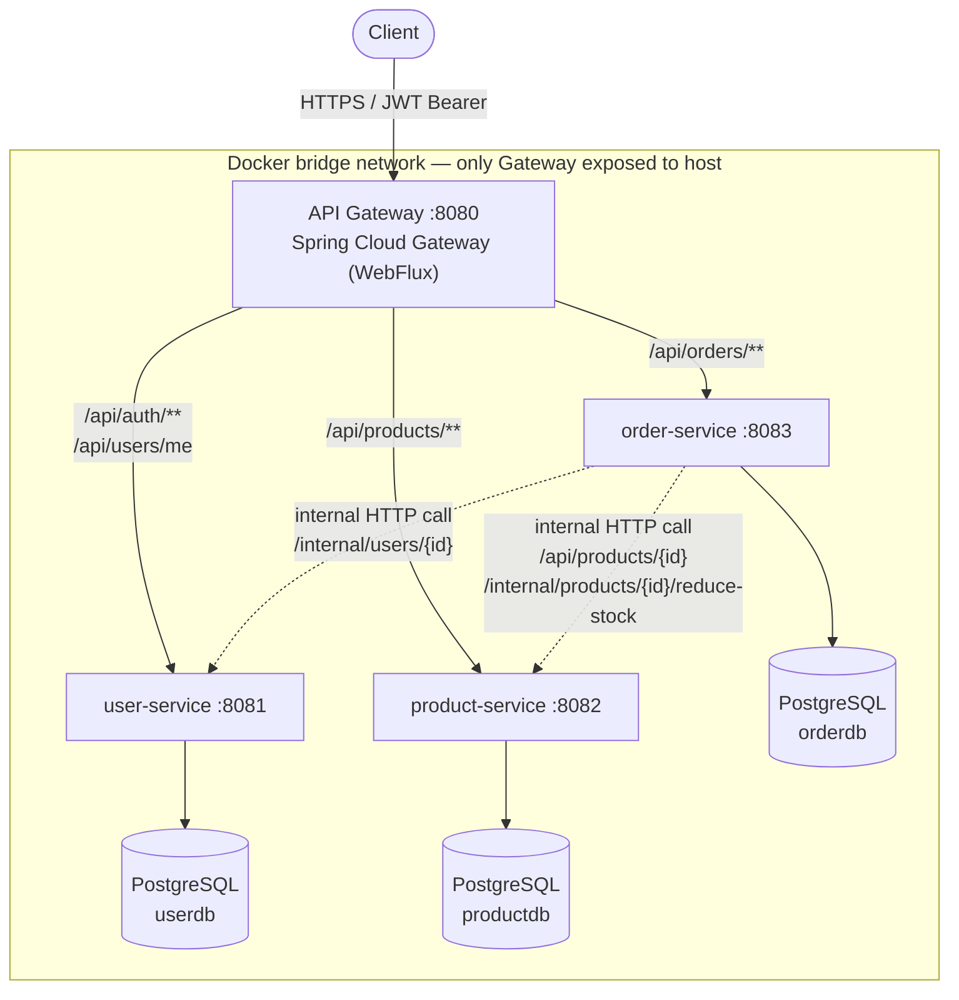
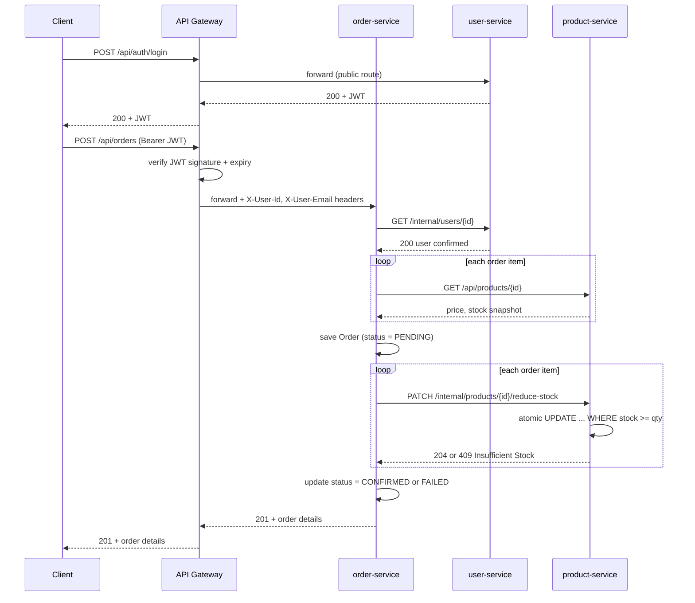
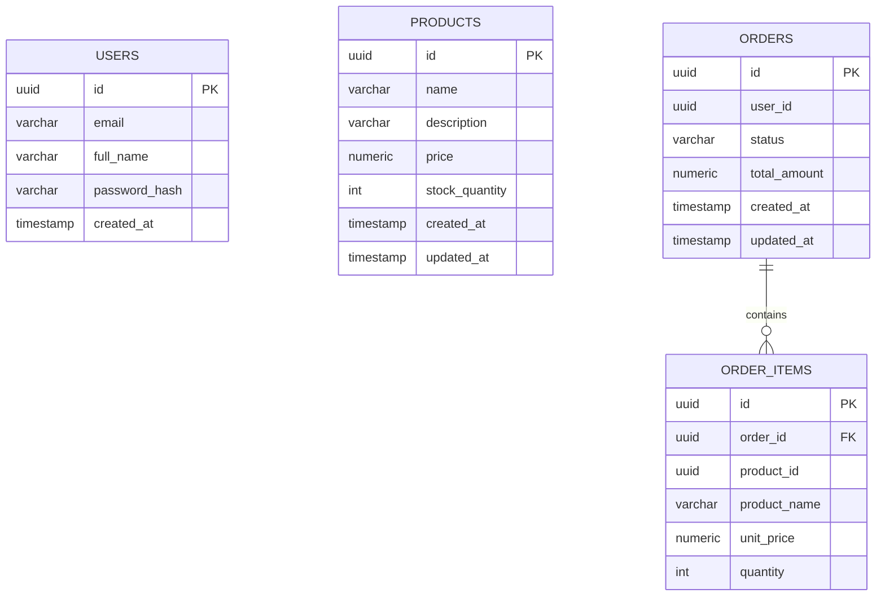

# Microservices Order Platform

A Spring Boot 4 / Java 21 microservices system implementing API gateway routing, stateless JWT authentication, service-to-service communication, atomic inventory control, and Docker-based deployment with genuine network isolation — not just service separation on paper.

This is a learning/portfolio project. It is built with production patterns where they matter (atomic stock updates, snapshot pricing, network-enforced trust boundaries) and deliberately simplified where the full production answer would be a separate project in itself (no Saga orchestration, no message broker, no RBAC yet). Every simplification is documented below, not hidden.

---

## Badges


---

## Table of Contents

- [Project Overview](#project-overview)
- [Features](#features)
- [Architecture](#architecture)
- [High-Level Request Flow](#high-level-request-flow)
- [Microservice Breakdown](#microservice-breakdown)
  - [API Gateway](#api-gateway)
  - [User Service](#user-service)
  - [Product Service](#product-service)
  - [Order Service](#order-service)
- [Database Design](#database-design)
- [Technology Stack](#technology-stack)
- [Project Structure](#project-structure)
- [Security](#security)
- [Docker](#docker)
- [Running Locally](#running-locally)
- [API Documentation](#api-documentation)
- [Example Requests](#example-requests)
- [Testing / Verification](#testing--verification)
- [Design Decisions](#design-decisions)
- [Challenges Faced](#challenges-faced)
- [Future Improvements](#future-improvements)

- [Resume Highlights](#resume-highlights)
- [Interview Questions](#interview-questions)
- [Lessons Learned](#lessons-learned)
- [License](#license)
- [Author](#author)

---

## Project Overview

This project models a small e-commerce backend — users, a product catalog, and order placement — as four independently deployable services instead of one monolith. The goal wasn't to reinvent e-commerce; it was to build the actual hard parts of microservices correctly: a real trust boundary at the edge, a real solution to the classic stock-overselling race condition, and a real (if intentionally scoped-down) answer to the "what happens when one service call in a chain fails" problem.

**Why microservices, here specifically:** each service owns its own database and is independently deployable. That's the entire benefit, and it's also the entire cost — no cross-service foreign keys, no shared transactions, and a genuine need for a network-level trust boundary instead of one shared security context. The project is structured to make both the benefit and the cost visible.

**Architecture philosophy:** the API Gateway is the only public-facing component. Every backend service validates nothing about the caller's identity itself — it trusts headers the gateway already verified, and that trust is backed by the fact that the backend services are *not reachable except through the gateway*, enforced at the Docker network level, not just by convention.

---

## Features

| Feature | Description | Status |
|---|---|---|
| User registration & login | Email/password signup with BCrypt hashing, JWT issuance on login | ✅ Done |
| Stateless JWT authentication | HS256-signed tokens validated once at the gateway | ✅ Done |
| API Gateway routing | Spring Cloud Gateway (reactive) routes by path to backend services | ✅ Done |
| Trusted-header propagation | Gateway injects `X-User-Id` / `X-User-Email` after validating the JWT | ✅ Done |
| Internal-only endpoints | `/internal/**` paths have no gateway route — unreachable from outside | ✅ Done |
| Product catalog CRUD | Create, list, get, update, delete with Bean Validation | ✅ Done |
| Atomic stock reservation | Single conditional `UPDATE` prevents overselling under concurrency | ✅ Done |
| Order placement | Validates user + products, snapshots price/name, reserves stock | ✅ Done |
| Service-to-service calls | Spring Framework 7 HTTP Interface clients (`@HttpExchange`) | ✅ Done |
| Dockerized deployment | Multi-stage builds, isolated bridge network, env-var secrets | ✅ Done |
| Network-enforced isolation | Only the gateway is exposed to the host; backend services are not | ✅ Done |
| Order history / listing | View past orders | ❌ Not built |
| Role-based access control | Admin vs. regular user distinction | ❌ Not built |
| Saga / distributed transactions | Compensating actions for partial order failure | ❌ Not built |
| Automated tests | Unit / integration test coverage | ❌ Not built |
| Refresh tokens | Token renewal without re-login | ❌ Not built |

---

## Architecture



JWT validation happens exactly once, inside the gateway's `JwtAuthenticationFilter`. Nothing downstream parses a token. `/internal/**` routes (used only for service-to-service calls) are deliberately absent from the gateway's route table — there's no path through the gateway that reaches them, regardless of token validity.

---

## High-Level Request Flow

Order placement, end to end:



---

## Microservice Breakdown

### API Gateway

**Purpose:** the single public entry point. Every external request passes through here first.

**Responsibilities**
- Routes requests by path predicate to the correct backend service
- Validates every incoming JWT (signature + expiry) via a custom `GlobalFilter`
- Injects `X-User-Id` and `X-User-Email` headers for downstream services after successful validation
- Rejects requests with missing/invalid tokens before they reach any backend service

**Technology:** Spring Cloud Gateway (`spring-cloud-starter-gateway-server-webflux`), reactive (Netty/WebFlux) — deliberately, since a gateway sits on the hot path of every request and shouldn't block a thread per in-flight connection.

**Public routes:** `/api/auth/register`, `/api/auth/login`, `/actuator/health`, `/actuator/info`.
**Protected routes (valid JWT required):** `/api/users/me`, `/api/products/**`, `/api/orders/**`.
**Not routed at all:** `/internal/**` — these exist on the backend services but have no path through the gateway.

---

### User Service

**Purpose:** identity — registration, authentication, and user lookups.

**Responsibilities**
- `POST /api/auth/register` — creates an account; password hashed with BCrypt before storage; rejects duplicate emails with `409`
- `POST /api/auth/login` — verifies credentials, issues a signed JWT (15-minute expiry) on success, returns a generic `401` message on failure regardless of whether the email or the password was wrong (prevents user enumeration)
- `GET /api/users/me` — returns the caller's own identity, read from gateway-injected headers, never from a token
- `GET /internal/users/{id}` — internal-only lookup used by `order-service` to confirm a user exists before placing an order; not reachable through the gateway

**Database:** owns `userdb` exclusively. Table is named `users`, not `user` — `USER` is a reserved SQL keyword.

**Security inside this service:** BCrypt password hashing, JWT signing (HS256). `SecurityConfig` permits all requests at the Spring Security layer — authentication enforcement lives at the gateway, not duplicated here.

---

### Product Service

**Purpose:** the product catalog and inventory.

**Responsibilities**
- Full CRUD: `POST/GET/PUT/DELETE /api/products`, `GET /api/products/{id}`
- `PATCH /internal/products/{id}/reduce-stock` — atomic, race-condition-safe stock decrement; internal-only, not reachable through the gateway
- All monetary values use `BigDecimal`, never `float`/`double` — floating-point binary representation cannot exactly represent most decimal fractions, which is an unacceptable bug class for currency

**The atomic decrement, specifically:**
```sql
UPDATE products
SET stock_quantity = stock_quantity - :quantity
WHERE id = :id AND stock_quantity >= :quantity
```
This single statement checks-and-decrements atomically at the database level. The naive alternative — `SELECT` current stock, subtract in application code, then `UPDATE` — has a real time-of-check-to-time-of-use race: two concurrent orders can both read "10 in stock," both proceed, and both succeed, overselling the product. The conditional `UPDATE` makes that impossible regardless of concurrency, because PostgreSQL's row-level locking handles the atomicity, not application code.

**Database:** owns `productdb` exclusively.

---

### Order Service

**Purpose:** order placement — the only service that calls the other two.

**Workflow for `POST /api/orders`:**
1. Confirm the user exists (`GET /internal/users/{id}` on `user-service`)
2. For each line item: fetch the product, verify there's enough stock for an early/friendly rejection, and snapshot its current `name` and `price` onto the order item
3. Save the order with status `PENDING`
4. For each line item: call the atomic reduce-stock endpoint on `product-service`
5. Mark the order `CONFIRMED` if every reservation succeeded, `FAILED` otherwise

**Why snapshotting matters:** `OrderItem` stores its own copy of `productName` and `unitPrice` rather than a foreign key into `product-service`'s database — because there isn't a shared database to key into, and because you genuinely want the historical record of what a customer paid even after the catalog price changes later.

**Service-to-service communication:** Spring Framework 7's HTTP Interface clients (`@HttpExchange` / `@GetExchange` / `@PatchExchange` interfaces), backed by `RestClient` and wired through `HttpServiceProxyFactory` with explicit connect/read timeouts — a hung downstream call cannot hang an order-service request thread indefinitely.

**Database:** owns `orderdb` exclusively; `Order` (header) and `OrderItem` (line items) tables, no foreign keys to other services' data.

---

## Database Design



Note what's deliberately absent: there is no foreign key from `ORDER_ITEMS.product_id` to `PRODUCTS.id`, and no foreign key from `ORDERS.user_id` to `USERS.id`. They're plain UUID values copied across a network call, not a database relationship — because `USERS`, `PRODUCTS`, and `ORDERS`/`ORDER_ITEMS` live in three physically separate PostgreSQL databases. **Each service owns its own database exclusively** — no service ever connects to another service's database directly. This is the actual mechanism that makes services independently deployable: changing `product-service`'s schema can never break `order-service`, because `order-service` was never able to query it directly in the first place.

---

## Technology Stack

| Layer | Technology |
|---|---|
| Language | Java 21 |
| Framework | Spring Boot 4.0.7 / Spring Framework 7.0.8 |
| API Gateway | Spring Cloud Gateway 5.0.2 (reactive, WebFlux) |
| Database | PostgreSQL 17 (one instance per service) |
| ORM | Spring Data JPA + Hibernate 7 |
| Security | Spring Security (BCrypt) + JJWT 0.13.0 |
| Service-to-service HTTP | Spring Framework 7 HTTP Interface clients (`RestClient`-backed) |
| Containerization | Docker, multi-stage builds |
| Orchestration (local) | Docker Compose, custom bridge network |
| Build tool | Maven (wrapper) |
| Boilerplate reduction | Lombok |

---

## Project Structure

```
microservices-project/
├── api-gateway/
│   ├── src/main/java/com/microservices/gateway/
│   │   └── filter/JwtAuthenticationFilter.java
│   ├── src/main/resources/application.yml
│   └── Dockerfile
├── user-service/
│   ├── src/main/java/com/microservices/user/
│   │   ├── controller/  (AuthController, UserController)
│   │   ├── service/     (UserService)
│   │   ├── repository/  (UserRepository)
│   │   ├── entity/      (User)
│   │   ├── dto/
│   │   ├── security/    (JwtService)
│   │   ├── config/      (SecurityConfig)
│   │   └── exception/
│   ├── src/main/resources/application.yml
│   └── Dockerfile
├── product-service/
│   ├── src/main/java/com/microservices/product/
│   │   ├── controller/  (ProductController)
│   │   ├── service/     (ProductService)
│   │   ├── repository/  (ProductRepository — atomic decrement query)
│   │   ├── entity/      (Product)
│   │   ├── dto/
│   │   └── exception/
│   ├── src/main/resources/application.yml
│   └── Dockerfile
├── order-service/
│   ├── src/main/java/com/microservices/order/
│   │   ├── controller/  (OrderController)
│   │   ├── service/     (OrderService)
│   │   ├── repository/  (OrderRepository)
│   │   ├── entity/      (Order, OrderItem, OrderStatus)
│   │   ├── client/      (UserServiceClient, ProductServiceClient)
│   │   ├── config/      (HttpClientConfig)
│   │   ├── dto/
│   │   └── exception/
│   ├── src/main/resources/application.yml
│   └── Dockerfile
├── docker-compose.yml
├── .env.example
├── .gitignore
└── README.md
```

---

## Security

- **Stateless JWT authentication** — HS256-signed tokens, 15-minute expiry, `sub` claim is the user's UUID
- **Password hashing** — BCrypt via Spring Security's `PasswordEncoder`, never plaintext, never reversible
- **Single validation point** — the gateway is the only place a JWT is ever parsed; backend services trust `X-User-Id`/`X-User-Email` headers instead
- **That trust is backed by network isolation, not assumption** — `user-service`, `product-service`, and `order-service` have no host port mapping in `docker-compose.yml`. They are reachable only from inside the Docker network, i.e., only from the gateway and from each other
- **Internal-only endpoints have no gateway route** — `/internal/users/{id}` and `/internal/products/{id}/reduce-stock` cannot be reached through the gateway with any token, valid or not, because no route predicate matches `/internal/**`
- **No user enumeration** — login failures return the identical message whether the email doesn't exist or the password is wrong
- **CSRF disabled, deliberately and specifically** — this is a stateless, token-based API with no cookies or browser sessions, which is exactly the case CSRF protection doesn't apply to. (Spring Security 7 enables CSRF protection for API endpoints by default, unlike earlier versions — this is an explicit override, not an oversight.)
- **Secrets via environment variables** — database credentials and the JWT signing secret are injected through Docker Compose's `environment:` blocks (sourced from a non-committed `.env` file), not hardcoded into tracked source

---

## Docker

**Multi-stage builds.** Each service's `Dockerfile` builds with a full JDK image, then ships a minimal JRE-only runtime image containing just the application jar — keeping build tools and source out of the final image.

**Non-root execution.** Every container runs as a dedicated `appuser`, not root.

**Custom bridge network.** All seven containers (4 services + 3 Postgres instances) share one Docker-managed bridge network (`microservices-net`). Containers resolve each other by **service name** as a DNS hostname — `order-service` calls `http://user-service:8081`, never `localhost`.

**Selective host exposure.** Only `api-gateway` has a `ports:` mapping to the host (`8080:8080`). The other three application services have no host port mapping at all — they simply cannot be reached from outside Docker, by design, not by firewall rule.

**Database containers** each get their own named volume and their own host port mapping (`5433`/`5434`/`5435`) purely for local debugging convenience with a DB GUI tool — a lower-stakes exposure than the application services, since it's data inspection, not an API surface.

**Health-gated startup.** Each Postgres container exposes a `pg_isready`-based healthcheck; each application service's `depends_on` waits for `condition: service_healthy` on its own database before starting.

---

## Running Locally

```bash
git clone <repo-url>
cd microservices-project

cp .env.example .env
# edit .env with real values — at minimum, generate a fresh JWT secret:
# openssl rand -base64 32

docker compose up --build
```

The gateway becomes reachable at `http://localhost:8080`. Wait for all four `Started ... Application in X seconds` log lines before sending requests.

**Verifying it's actually running correctly** (not just "containers up"):
```bash
curl http://localhost:8080/actuator/health        # gateway — should be reachable
curl http://localhost:8081/actuator/health         # should FAIL to connect — proves network isolation
```

---

## API Documentation

### Auth (`user-service`, via gateway)

| Method | Path | Auth | Description |
|---|---|---|---|
| POST | `/api/auth/register` | None | Create an account |
| POST | `/api/auth/login` | None | Exchange credentials for a JWT |
| GET | `/api/users/me` | JWT | Current user's identity |

### Products (`product-service`, via gateway)

| Method | Path | Auth | Description |
|---|---|---|---|
| POST | `/api/products` | JWT | Create a product |
| GET | `/api/products` | JWT | List all products |
| GET | `/api/products/{id}` | JWT | Get one product |
| PUT | `/api/products/{id}` | JWT | Update a product |
| DELETE | `/api/products/{id}` | JWT | Delete a product |

### Orders (`order-service`, via gateway)

| Method | Path | Auth | Description |
|---|---|---|---|
| POST | `/api/orders` | JWT | Place an order |

### Internal-only (not reachable via gateway, no auth applicable)

| Method | Path | Caller | Description |
|---|---|---|---|
| GET | `/internal/users/{id}` | order-service | Confirm a user exists |
| PATCH | `/internal/products/{id}/reduce-stock` | order-service | Atomic stock reservation |

---

## Example Requests

**Register**
```json
POST /api/auth/register
{
  "fullName": "Jane Doe",
  "email": "jane@example.com",
  "password": "password123"
}
```

**Login**
```json
POST /api/auth/login
{
  "email": "jane@example.com",
  "password": "password123"
}
```
Response:
```json
{
  "token": "eyJhbGciOiJIUzI1NiJ9...",
  "tokenType": "Bearer",
  "expiresInSeconds": 900
}
```

**Create Product**
```json
POST /api/products
Authorization: Bearer <token>
{
  "name": "Mechanical Keyboard",
  "description": "Hot-swappable, 75% layout",
  "price": 89.99,
  "stockQuantity": 25
}
```

**Place Order**
```json
POST /api/orders
Authorization: Bearer <token>
{
  "items": [
    { "productId": "81e24547-5f9b-4947-bda4-e243ad5a3860", "quantity": 2 }
  ]
}
```
Response:
```json
{
  "id": "e1d1de90-775a-4b8e-90b0-fd5af0839a09",
  "userId": "00e3c15e-8fb5-467d-9a7a-7af1239678f8",
  "status": "CONFIRMED",
  "totalAmount": 20.00,
  "items": [
    {
      "productId": "81e24547-5f9b-4947-bda4-e243ad5a3860",
      "productName": "Test Widget",
      "unitPrice": 10.00,
      "quantity": 2,
      "subtotal": 20.00
    }
  ],
  "createdAt": "2026-06-26T17:47:27.529911Z"
}
```

---

## Testing / Verification

There is no automated test suite yet beyond each service's default, unmodified Spring Boot-generated `contextLoads()` stub — this is the most honest gap in the project and the most natural next step.

Verification so far has been manual and end-to-end, through Postman, including:
- Full register → login → authenticated request flow through the gateway
- Rejection paths: duplicate email (`409`), bad credentials (`401`), validation errors (`400`)
- Insufficient stock (`409`) and nonexistent product (`400`) on order placement
- Confirming `localhost:8081`/`8082`/`8083` are unreachable directly once Dockerized, proving network isolation rather than assuming it
- Confirming `/internal/**` returns `404` through the gateway regardless of token validity

---

## Design Decisions

**Gateway-validated JWT, header-trust downstream.** Validating once at the edge instead of in every service avoids duplicating JWT-parsing logic four times. This is only safe because of the network isolation described above — without it, anyone reaching a backend service directly could forge identity headers. Both halves of that sentence are necessary; this README states both rather than the comfortable half.

**No role-based access control yet.** Any authenticated user can currently manage the product catalog. Building this requires adding a `role` claim to the JWT and authorization checks in `product-service` — a real, scoped next feature, not implemented here.

**No Saga pattern for order failure.** If a multi-item order's stock reservation fails partway through, the items already reserved before the failure are not rolled back. The correct production answer is the Saga pattern — orchestrated or choreographed compensating transactions, typically via a message broker. That is a separate, substantial piece of infrastructure and is intentionally out of scope for this project's current size.

**Snapshot pricing, not live lookups.** `OrderItem` stores the product's name and price at the moment of purchase rather than referencing the live catalog value, because a customer's receipt should reflect what they actually paid, not today's price.

**`BigDecimal` for all currency.** `double`/`float` cannot exactly represent most decimal fractions in binary floating point — a real, expensive bug class for money, not a style preference.

**Atomic SQL `UPDATE` for stock, not read-then-write.** Eliminates a genuine concurrent-order race condition at the database level rather than attempting to manage it in application code.

**`ddl-auto: update`, not Flyway/Liquibase.** Acceptable for active development on a learning project; a real team would manage schema changes through versioned migrations, not Hibernate's automatic schema inference.

---

## Challenges Faced

These are real issues hit during development, not hypothetical ones — kept here because the debugging process is more informative than pretending the build worked on the first try.

- **Lombok's annotation processor silently not running under Maven.** Getters, setters, and constructors generated by `@Getter`/`@Setter`/`@RequiredArgsConstructor` simply didn't exist at compile time, producing confusing "method not found" errors. Fixed by explicitly declaring Lombok in the Maven compiler plugin's `annotationProcessorPaths` instead of relying on implicit classpath discovery.
- **JJWT's API changed its method names in the version used here.** Many existing tutorials show the deprecated `Jwts.builder().setSubject(...)` style; the current API drops the `set` prefix entirely (`.subject(...)`, `.claim(...)`) and parsing moved to `Jwts.parser().verifyWith(key).build().parseSignedClaims(token)`.
- **Spring Framework 7's new declarative HTTP client registry (`@ImportHttpServices` + `spring.http.client.service.group.*.base-url`) failed to apply its configured base URL**, producing `URI with undefined scheme` at runtime. This is a brand-new feature (months old at the time of building this) with thin field documentation. Resolved by falling back to the well-established, manually-wired `RestClient` + `HttpServiceProxyFactory` pattern instead of continuing to chase an undocumented edge case in new tooling.
- **`PATCH` requests failed against the JDK's legacy `HttpURLConnection`-based request factory** (`Invalid HTTP method: PATCH`) — a genuinely old JDK limitation, since `HttpURLConnection`'s allowed-method list predates PATCH's 2010 standardization. Fixed by switching to `JdkClientHttpRequestFactory`, backed by Java 11's modern `java.net.http.HttpClient`.
- **Spring Boot's jarmode tooling changed twice between attempts.** `-Djarmode=layertools` is deprecated in favor of `-Djarmode=tools`, but the new mode's default `extract` behavior produces a different, CDS-oriented layout — requiring an explicit `--layers` flag to get the older four-folder structure back. Even with that flag, the resulting `application` layer contained a packaged jar rather than unpacked classes, which `JarLauncher` could not run, throwing `ClassNotFoundException`. Resolved by abandoning the layered-jar optimization entirely in favor of a simple, unambiguous single-jar runtime stage.

---

## Future Improvements

- [ ] Role-Based Access Control (admin vs. regular user)
- [ ] Saga pattern for distributed order/inventory consistency
- [ ] Circuit breaker (Resilience4j) for service-to-service calls
- [ ] Order history / listing endpoints
- [ ] Refresh tokens
- [ ] Redis caching for product catalog reads
- [ ] Message queue (Kafka or RabbitMQ) for event-driven stock updates
- [ ] Observability: Prometheus + Grafana, distributed tracing
- [ ] Flyway or Liquibase schema migrations
- [ ] CI/CD via GitHub Actions
- [ ] Kubernetes manifests / Helm chart, horizontal scaling
- [ ] API versioning, OpenAPI/Swagger documentation
- [ ] Pagination and search on the product catalog
- [ ] Soft deletes and audit logging
- [ ] Rate limiting at the gateway
- [ ] Automated unit and integration test suite

---


## Resume Highlights

- Designed and built a 4-service Spring Boot microservices system (API gateway + 3 domain services) with independent PostgreSQL databases per service and full Docker Compose deployment
- Implemented stateless JWT authentication validated once at a reactive Spring Cloud Gateway, with trusted-header propagation to backend services and Docker network-level enforcement of the trust boundary
- Solved a real concurrent-inventory race condition with an atomic conditional SQL `UPDATE`, avoiding the classic overselling bug under simultaneous orders
- Built cross-service communication using Spring Framework 7's declarative HTTP Interface clients, including debugging and resolving a base-URL binding defect in brand-new framework tooling
- Designed and enforced a public/internal API surface split (`/api/**` vs `/internal/**`) so privileged operations are unreachable from outside the system regardless of caller authentication
- Containerized all services with multi-stage Docker builds and non-root execution; debugged and resolved JDK-level and Spring Boot tooling-level packaging defects during the Dockerization process

---

## Interview Questions

**Q: Why does the gateway trust headers instead of having every service validate the JWT itself?**
A: Centralizing validation avoids duplicating JWT-parsing logic across every service. It's only safe because backend services are unreachable except through the gateway — enforced by Docker network isolation (no host port mapping), not by convention. If that network guarantee weren't in place, header-trust would be a real vulnerability, since anyone reaching a service directly could forge an identity header.

**Q: How do you prevent overselling a product under concurrent orders?**
A: A single SQL statement — `UPDATE products SET stock_quantity = stock_quantity - :qty WHERE id = :id AND stock_quantity >= :qty` — performs the check and the decrement atomically at the database level. PostgreSQL's row-level locking makes this safe under concurrency without any application-level locking. The naive read-then-write approach has a genuine time-of-check-to-time-of-use race that this avoids entirely.

**Q: What happens if an order has multiple items and stock reservation fails on the second item after succeeding on the first?**
A: Today, the order is marked `FAILED`, but the first item's stock reservation is not rolled back — that's a known, documented gap. The correct fix is the Saga pattern with compensating transactions, typically backed by a message broker, which is out of scope for this project's current size but is a deliberate, named next step rather than an unnoticed bug.

**Q: Why does `order-service` store a copy of the product name and price instead of a foreign key?**
A: There's no foreign key to have — `order-service` and `product-service` use physically separate databases. Beyond that constraint, snapshotting is actually the correct behavior anyway: an order should reflect what was actually charged at purchase time, not the catalog's current price.

**Q: Why BigDecimal instead of double for prices?**
A: IEEE 754 floating-point binary representation cannot exactly represent most decimal fractions — `0.1 + 0.2` is not exactly `0.3` in floating point. For currency, that's a real, costly bug class, not a rounding curiosity. `BigDecimal` with explicit precision/scale is the standard answer.

---

## Lessons Learned

Building this surfaced a pattern worth naming directly: a meaningful fraction of the real difficulty in this project wasn't the business logic — it was that several pieces of tooling (Spring Framework 7's HTTP client registry, Spring Boot's `tools` jarmode) are genuinely new, and the gap between "officially documented" and "battle-tested by the wider community" is where real bugs hide. The fix in every case was the same: read the actual exception and stack trace carefully rather than pattern-matching to the first plausible explanation, and when a brand-new abstraction's behavior doesn't match its own documentation, falling back to an older, well-understood mechanism is a legitimate engineering decision, not a failure to use the "modern" way.

The other recurring lesson was that the genuinely hard parts of microservices aren't the network calls — they're the implications of not having a shared database or a shared transaction anymore. Snapshot pricing, atomic stock updates, and the documented Saga-pattern gap all trace back to that one structural fact.

---

## License

This project is licensed under the MIT License — see the `LICENSE` file for details.

---

## Author

**Muhammad Isa Haameem**

- GitHub: [https://github.com/IsaHaameem](https://github.com/IsaHaameem)
- LinkedIn: [https://www.linkedin.com/in/muhammad-isa-haameem-ba420834a/](https://www.linkedin.com/in/muhammad-isa-haameem-ba420834a/)
- Email: isahameem@gmail.com
